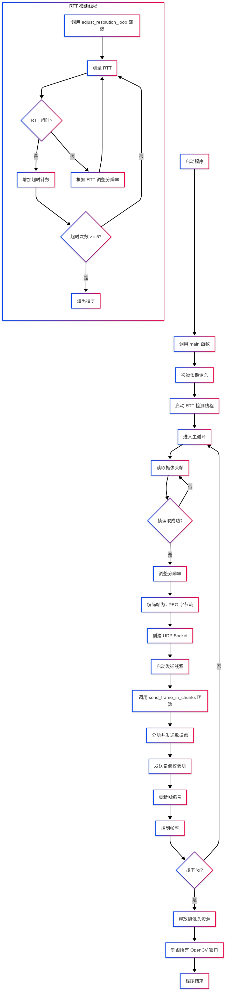
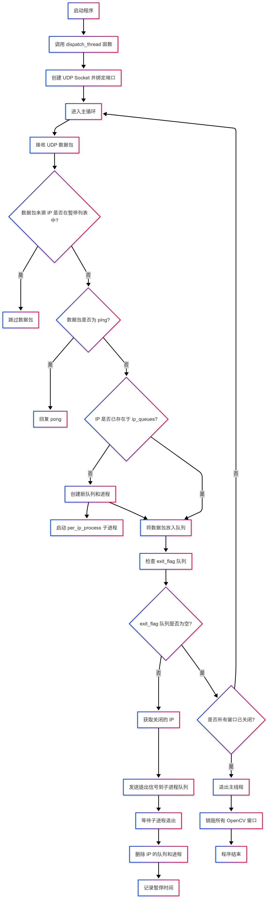

# UDP - 实时视频流传输

### 任务：实现基于UDP的实时视频传输系统

### 发送端：
- 从摄像头捕获帧，分块编码后通过UDP发送

### 接收端：
- 重组帧并显示，支持丢包时的错误隐藏（如重复上一帧）

### 优化方向：
- 动态调整码率（根据网络延迟增减分辨率）
- 前向纠错（FEC）减少重传延迟
- 实现多IP视频传输，通过IP自动创建接收进程

---

### 发送端流程图


### 接收端流程图


---

### 运行步骤

### 1. 运行sender.py
注意sender的target_ip和reciever的ip要一致
```bash
python sender.py
```
### 2. 运行reciever.py
接收端是通过监听所有发送至该节点的IP
每当接收端收到不同IP时候就独立创建一个进程，每个进程中由多线程负责接收和处理数据包。
```bash
python receiver.py
```
### 3. 运行效果
在设置好收发端后我们可以看到如下效果
 <video src="demo.mov" controls autoplay loop width="800"></video>
可以发现，视频延迟度低，且画面流畅，适合实时应用。

接收端关闭接收窗口`q`，或者`esc`退出窗口，当所有窗口均关闭时候接收方主进程结束
 

发送端当收到5次RTT超时，发送端退出主进程，停止发送。
